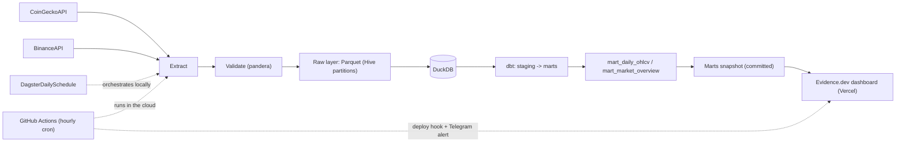

# crypto-market-elt

Production-style **ELT pipeline** for crypto market data: extracts daily market snapshots
(CoinGecko) and OHLCV candles (Binance), validates them at ingestion, lands them as
Hive-partitioned Parquet, loads them into DuckDB, and transforms them with dbt into
analytics-ready marts. Orchestrated with Dagster.

**Live dashboard:** see link in the repo description (Evidence.dev on Vercel, refreshed hourly by GitHub Actions).



## What this demonstrates

- **ELT pattern**: raw data lands untransformed; all business logic lives in dbt (staging views → mart tables), fully tested.
- **Data contracts**: human-readable contracts in `schemas/`, enforced at ingestion by pandera schemas in `src/crypto_market_elt/validate/` — bad data never reaches the warehouse.
- **Idempotency**: re-running a day overwrites its partition; staging models deduplicate by natural key keeping the latest ingestion.
- **Config-driven**: sources, symbols, retries and rate limits are declarative YAML in `config/`, validated by pydantic at startup. Secrets only via env vars (`ELT_` prefix).
- **Orchestration as assets**: Dagster asset graph wires ingestion → warehouse load → dbt models automatically (load assets share keys with dbt sources).
- **Quality gates**: pandera at ingestion, 14 dbt data tests in the warehouse, pytest + ruff in CI on every push.

## Quickstart

```bash
# 1. install uv (https://docs.astral.sh/uv/) then:
uv sync

# 2. run the full pipeline (extract + validate + load + dbt)
make pipeline
#   ...or without make:
uv run python -m crypto_market_elt.run
uv run dbt build --project-dir dbt --profiles-dir dbt

# 3. explore the asset graph in the Dagster UI
make dev   # uv run dagster dev -f orchestration/definitions.py
```

No API keys required. An optional CoinGecko demo key raises rate limits (see `.env.example`).

## Repository layout

```
config/          declarative source & pipeline params (YAML, validated by pydantic)
schemas/         data contracts per raw dataset
src/…/extract/   HTTP clients (retries + exponential backoff)
src/…/validate/  pandera schemas — ingestion-time validation
src/…/load/      Parquet writer (Hive partitions) + DuckDB loader
dbt/             staging views, mart tables, data tests (incl. custom generic tests)
orchestration/   Dagster assets, daily schedule (06:00 UTC, after daily candle close)
tests/           pytest suite with real API response fixtures (HTTP mocked via respx)
dashboard/       Evidence.dev project (static BI site, deployed to Vercel)
```

Data (`data/`), warehouse (`warehouse/`) and logs are **never committed** — only small test
fixtures live in the repo. The single exception is `dashboard/sources/crypto/crypto_marts.duckdb`,
a small snapshot of the marts that Evidence needs at build time on Vercel.

No `docker-compose.yml` on purpose: everything here runs with `uv` against local files
(DuckDB is a single file, no services to compose). The flagship project (streaming +
ClickHouse) is where containers earn their place.

## Marts

| Model | Grain | Highlights |
|---|---|---|
| `mart_daily_ohlcv` | symbol × day | daily returns, 7d/30d rolling volatility, 30d avg volume |
| `mart_market_overview` | day | total market cap, BTC dominance, top-10 concentration |

## Dashboard

The `dashboard/` folder is an [Evidence.dev](https://evidence.dev) project reading a
committed snapshot of the marts:

```bash
make snapshot            # export marts -> dashboard/sources/crypto/crypto_marts.duckdb
cd dashboard
npm install
npm run sources && npm run dev   # local dev server on :3000
```

## Automation

Two schedulers, one pipeline:

- **Dagster** (local orchestration + asset lineage UI): `make dev`, daily schedule at 06:00 UTC.
- **GitHub Actions** (`refresh.yml`, hourly cron): runs the full pipeline on a runner,
  merges the fresh marts with the accumulated history and force-pushes the snapshot to
  the `data` branch (single replaced commit — `main` history stays clean and the repo
  never grows), triggers a Vercel deploy hook to rebuild the dashboard from that branch,
  and sends a Telegram notification. Zero infrastructure cost — no machine needs to be on.

## Development

```bash
make lint   # ruff
make test   # pytest (10 tests, HTTP fully mocked)
```

CI (GitHub Actions) runs lint, unit tests and `dbt parse` on every push.
