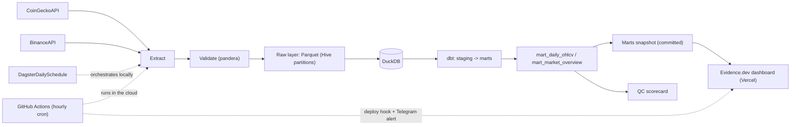

# crypto-market-elt

Production-style **ELT pipeline** for crypto market data: extracts daily market snapshots
(CoinGecko) and OHLCV candles (Binance), validates them at ingestion, lands them as
Hive-partitioned Parquet, loads them into DuckDB, and transforms them with dbt into
analytics-ready marts. Orchestrated with Dagster. Runnable locally with `uv` or in
**Docker**.

**Live dashboard:** [crypto-market-elt on Vercel](https://crypto-market-elt-git-data-marioespinosaperales-projects.vercel.app/) (Evidence.dev, refreshed hourly by GitHub Actions).



## Research / QC framing

This repo is the **ingestion-contract** piece of the portfolio: a realistic market-data
task with a fail-fast quality gate so bad rows never pollute downstream consumers.

| Concern | How this repo answers it |
|---|---|
| Usable environment | Config-driven Python/Linux pipeline, reproducible via Docker or `uv` |
| Reliable rubric | Human-readable contracts in `schemas/` + executable pandera schemas |
| Useful data trajectory | Idempotent Hive Parquet → DuckDB → tested dbt marts |
| Validation loop | Contract probes + warehouse sanity → `artifacts/qc_scorecard.md` |
| ML signal | IsolationForest second-line QC + naive vs ARIMA forecast eval |
| Research | Hypothesis → holdout metrics → [RESEARCH.md](RESEARCH.md) |

### ML (second-line QC)

Unsupervised anomaly detection on validated OHLCV (returns, log-volume, range, rolling
z-scores). Complements pandera contracts — it flags review candidates; it does not
replace fail-fast ingestion validation.

```bash
make ml   # → artifacts/ml_anomaly_report.md
```

### Time-series + event-study research

Naive vs ARIMA(1,1,1) one-step forecast eval, plus a quasi-experimental event study
(pre/post log-return difference-in-means around an injected shock).

```bash
make research   # → artifacts/research_timeseries.md + research_event_study.md
```

See [RESEARCH.md](RESEARCH.md).

Sibling stories: [dex-trades-canonical](https://github.com/marioespinosaperales/dex-trades-canonical) (labeling rubric) and [lp-history-reconstructor](https://github.com/marioespinosaperales/lp-history-reconstructor) (ground-truth eval).

## What this demonstrates

- **Data contracts as QC**: human-readable contracts in `schemas/`, enforced at ingestion by pandera — bad data never reaches the warehouse.
- **ELT pattern**: raw data lands untransformed; business logic lives in dbt (staging → marts), fully tested.
- **QC scorecard**: `python -m crypto_market_elt.evals` probes pass/fail contract cases and warehouse freshness/row counts.
- **ML anomaly QC**: `python -m crypto_market_elt.ml` IsolationForest second-line check on OHLCV features.
- **Time-series eval**: naive vs ARIMA holdout forecasts (statsmodels).
- **Event study**: quasi-experimental pre/post return shift around a synthetic shock.
- **Idempotency**: re-running a day overwrites its partition; staging deduplicates by natural key.
- **Config-driven + Docker**: YAML + pydantic (`ELT_` secrets); `Dockerfile` / `docker compose` for a reproducible Linux run.
- **Orchestration**: Dagster asset graph wires ingestion → load → dbt; GitHub Actions hourly refresh.

## Quickstart

```bash
# 1. install uv (https://docs.astral.sh/uv/) then:
uv sync

# 2. run the full pipeline (extract + validate + load + dbt)
make pipeline

# 3. QC scorecard (contract probes + warehouse sanity)
make eval   # → artifacts/qc_scorecard.md

# 4. ML anomaly report (second-line QC)
make ml     # → artifacts/ml_anomaly_report.md

# 5. Research reports (timeseries + event study)
make research

# 6. optional: Dagster UI
make dev
```

**Docker** (same pipeline + scorecard, no local Python required beyond Docker):

```bash
make docker-build
make docker-pipeline   # docker compose run --rm pipeline
# or smoke tests inside the image:
make docker-test
```

No API keys required. An optional CoinGecko demo key raises rate limits (see `.env.example`).

## Repository layout

```
config/          declarative source & pipeline params (YAML, validated by pydantic)
schemas/         data contracts per raw dataset
src/…/extract/   HTTP clients (retries + exponential backoff)
src/…/validate/  pandera schemas — ingestion-time validation
src/…/evals/     QC scorecard CLI (contract probes + warehouse sanity)
src/…/ml/        IsolationForest OHLCV anomaly report (second-line QC)
src/…/load/      Parquet writer (Hive partitions) + DuckDB loader
dbt/             staging views, mart tables, data tests (incl. custom generic tests)
orchestration/   Dagster assets, daily schedule (06:00 UTC, after daily candle close)
tests/           pytest suite with real API response fixtures (HTTP mocked via respx)
dashboard/       Evidence.dev project (static BI site, deployed to Vercel)
Dockerfile       reproducible Linux image (uv + pipeline)
```

Data (`data/`), warehouse (`warehouse/`), `artifacts/`, and logs are **never committed** —
only small test fixtures live in the repo. The single exception is
`dashboard/sources/crypto/crypto_marts.duckdb`, a small snapshot of the marts that
Evidence needs at build time on Vercel.

## Marts

| Model | Grain | Highlights |
|---|---|---|
| `mart_daily_ohlcv` | symbol × day | daily returns, 7d/30d rolling volatility, 30d avg volume |
| `mart_market_overview` | day | total market cap, BTC dominance, top-10 concentration |

## Dashboard

The `dashboard/` folder is an [Evidence.dev](https://evidence.dev) project reading a
committed snapshot of the marts:

```bash
make snapshot            # export marts -> dashboard/sources/crypto/crypto_marts.duckdb
cd dashboard
npm install
npm run sources && npm run dev   # local dev server on :3000
```

## Automation

Two schedulers, one pipeline:

- **Dagster** (local orchestration + asset lineage UI): `make dev`, daily schedule at 06:00 UTC.
- **GitHub Actions** (`refresh.yml`, hourly cron): runs the full pipeline on a runner,
  merges the fresh marts with the accumulated history and force-pushes the snapshot to
  the `data` branch (single replaced commit — `main` history stays clean and the repo
  never grows), triggers a Vercel deploy hook to rebuild the dashboard from that branch,
  and sends a Telegram notification. Zero infrastructure cost — no machine needs to be on.

## Development

```bash
make lint   # ruff
make test   # pytest (HTTP fully mocked)
make eval   # QC scorecard
```

CI (GitHub Actions) runs lint, unit tests and `dbt parse` on every push.
